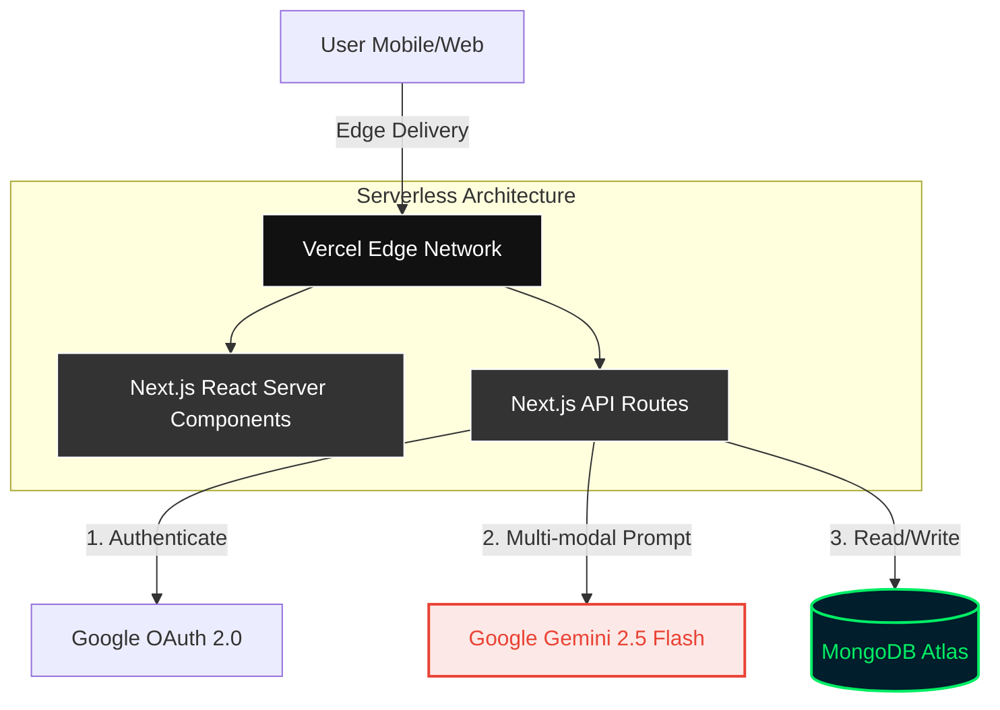
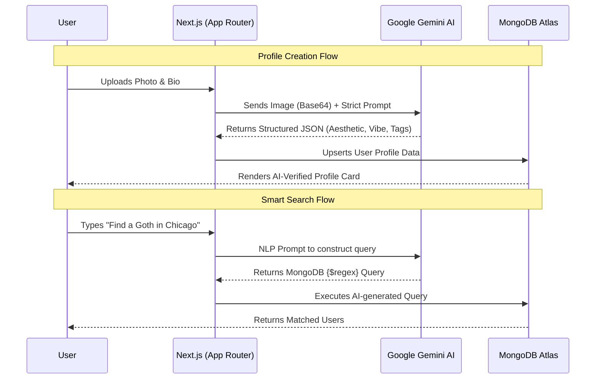

# ♾️ Anurupa (अनुरूप)
> **The AI-Powered Personality & Aesthetic Engine.**
> Because manually typing out your "vibe" is exhausting. Let the AI do the judging.

### 🚀 Live Demo: [anurupa.vercel.app](https://anurupa.vercel.app/)  

**Anurupa App Screenshot**

## 💡 What is it?
Anurupa (Sanskrit for "suitable" or "corresponding") is a full-stack social matching platform. Instead of basic drop-down filters, users upload a photo, and our **Google Gemini 2.5 Flash Multimodal AI** scans their outfit, lighting, and posture to automatically classify their *Aesthetic* (e.g., Streetwear, Minimalist), extract their *Vibe*, and tag their fashion items. 

Want to find a "Minimalist in New York"? Just type it in the smart search. The AI translates human language into complex database queries on the fly. 

---

## 🏗️ Data Flow & Architecture

 # System Architecture

---
## 🧠 Engineering & System Design
Beyond just wiring APIs together, Anurupa is built to be a resilient, scalable, and production-ready system. Here are the core engineering decisions:

1. **Deterministic AI via Schema Enforcement**
Large Language Models are notoriously unpredictable. To use Gemini 2.5 Flash in a production database pipeline, strict multi-modal prompt constraints were engineered. The AI is forced to return a stringified JSON object matching a specific schema, entirely bypassing the unpredictability of conversational AI and ensuring database integrity.

2. Database Design & Scalability (MongoDB)
Why NoSQL? The attributes of human "aesthetics" and "vibes" are highly dynamic. MongoDB's document model allows user profiles to hold flexible arrays of tags without requiring rigid, expensive SQL migrations every time a new fashion trend drops.

Search Optimization: The smart search feature relies heavily on regex text matching. To prevent expensive full-collection scans ($COLLSCAN), proper indexing was implemented on high-traffic fields (location, aesthetic, tags) to keep query times in the low milliseconds.

3. Rendering Strategy & Edge Caching
Utilizing the Next.js App Router, the application rendering is strategically split:

Static Site Generation (SSG): Landing and informational pages are pre-compiled and served globally from Vercel's Edge CDN for instant load times.

Server-Side Rendering (SSR) & API Routes: Search feeds and profile generation run dynamically on the server to protect API keys (Gemini, DB) and ensure users always see the freshest data.

4. Zero-Trust Security & RBAC
Integrated Google OAuth 2.0 via NextAuth. The application features a robust Role-Based Access Control (RBAC) system. Admin routes and components are protected by server-side session validation, ensuring unauthorized users cannot access the moderation dashboard or manipulate database records.
---
# 🎮 How to use Anurupa
Sign In: Click "Login" (Secure authentication via Google OAuth).

Upload a Fit Pic: Go to the "Create" tab. Upload a clear picture of yourself. (Note: The AI includes human-verification checks).

Get Analyzed: Hit submit. The AI will analyze your vibe and stamp your profile with your true Aesthetic.

Find Your Match: Use the search bar. Try typing natural language queries like "Vintage lover in Chicago" or "Mysterious streetwear".

---
# 🛠️ Developer Guide: Local Setup
Prerequisites
Node.js (LTS)

A free MongoDB Atlas Cluster

A Google Cloud Console account (for OAuth)

A Google AI Studio API Key (for Gemini)

Installation  

1. Clone the repository  

Bash  
git clone https://github.com/YOUR_GITHUB_USERNAME/Anurupa.git  
cd Anurupa 

2. Install Dependencies  

Bash  
npm install 

3. Configure Environment Variables
   
Create a .env.local file in the root directory. Add the following keys:  

Code snippet  
MONGODB_URI=mongodb+srv://<user>:<password>@cluster0...   
GOOGLE_CLIENT_ID=your_oauth_client_id.apps.googleusercontent.com  
GOOGLE_CLIENT_SECRET=your_oauth_secret  
GOOGLE_API_KEY=your_gemini_api_key  
NEXTAUTH_SECRET=any_random_long_string_for_encryption  
NEXTAUTH_URL=http://localhost:3000  

4. Start the Development Server
Bash 
npm run dev  
Open http://localhost:3000 with your browser to see the result.  
------  

Designed & Built by DEVAL  

